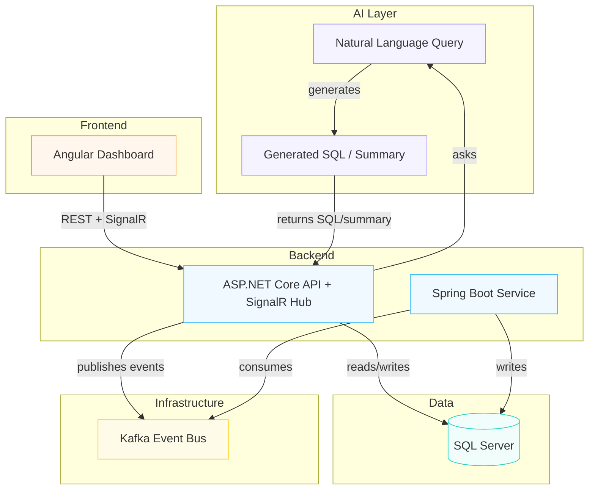

# Real-time-hospital-admissions-dashboard-with-Kafka-SignalR-and-AI-powered-insights
Real-time hospital admissions dashboard with Kafka, SignalR, and AI-powered insights

```mermaid
graph TB
    subgraph AI["AI Layer"]
        NLQuery["Natural Language Query"]
        GenSQL["Generated SQL / Summary"]
    end
    
    subgraph Data["Data"]
        SQLServer[("SQL Server")]
    end
    
    subgraph Infra["Infrastructure"]
        Kafka["Kafka Event Bus"]
    end
    
    subgraph Backend["Backend"]
        AspNetAPI["ASP.NET Core API + SignalR Hub"]
        SpringBoot["Spring Boot Service"]
    end
    
    subgraph Frontend["Frontend"]
        Angular["Angular Dashboard"]
    end
    
    Angular -->|REST + SignalR| AspNetAPI
    AspNetAPI -->|reads/writes| SQLServer
    AspNetAPI -->|publishes events| Kafka
    SpringBoot -->|consumes| Kafka
    SpringBoot -->|writes| SQLServer
    AspNetAPI -->|asks| NLQuery
    NLQuery -->|generates| GenSQL
    GenSQL -->|returns SQL/summary| AspNetAPI
    
    classDef aiLayer stroke:#a78bfa,fill:#f5f3ff
    classDef dataLayer stroke:#2dd4bf,fill:#f0fdfa
    classDef infraLayer stroke:#facc15,fill:#fefce8
    classDef backendLayer stroke:#38bdf8,fill:#f0f9ff
    classDef frontendLayer stroke:#fb923c,fill:#fff7ed
    
    class NLQuery,GenSQL aiLayer
    class SQLServer dataLayer
    class Kafka infraLayer
    class AspNetAPI,SpringBoot backendLayer
    class Angular frontendLayer
```
